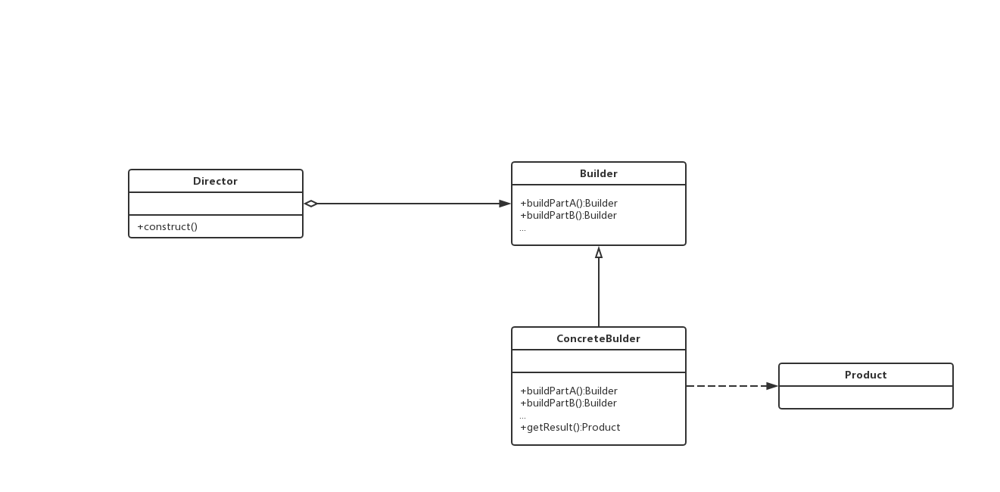
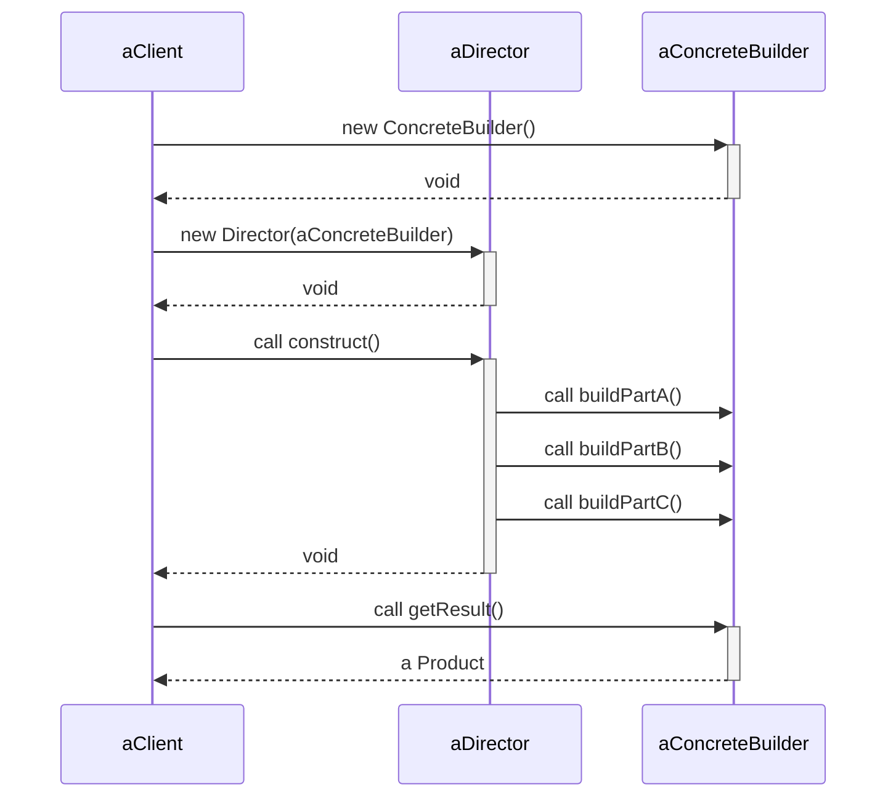

# Diagram

## 创建型

### Abstract Factory

### Builder
#### 结构

#### 参与者

- Builder

  为创建Product对象的各个部件指定抽象接口

- ConcreteBuilder

  - 实现Builder接口
  - 提供获取最终Product的接口。`getResult()`
- Director

  使用Builder接口的对象
- Product
  - 被构造的复杂对象，ConcreteBuilder创建该产品的内部表示并定义它的装配过程

#### 协作

#### 适应性

#### 效果
