# Git简单介绍(没有写完)

在工作工程中，我感觉UI有些同事对Git的几个概念是不明确的。正好需要写两篇新人技术总结，所以写这篇GIT的文章，希望有所帮助。

先上一张图。

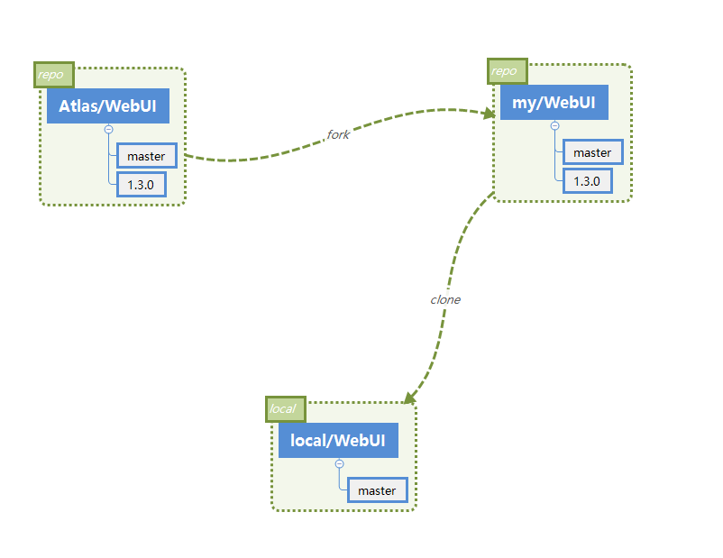

由于是在家中写的这篇文章，所以名字不会和实际对应上。这里`Atlas/WebUI`对应的就是我们项目。`my/WebUI`就是我们fork过去的。`local/WebUI`就是我们从自己fork的clone下来的。

* repo,就是repository，也就是代码仓库。这里`Atlas/WebUI`和`my/WebUI`都叫做repo，都是仓库，***不叫做主干分支***。

  fork的就是把整个仓库都拷贝过来了，当然还有一些其他关系由服务器管理着，但是可以理解为就是把对应仓库拷贝过来了。

* branch,这个才是分支，这里上面两个仓库里面的`master`,`1.3.0`就是分支，`master`其实就是主干分支。每个仓库都有自己的分支。

这两个概念一定要搞清楚，不要混淆。


然后看看我们的日常操作，假设我同时要开发三个功能，dashboard，switchprofile和alert。我们的做法是：

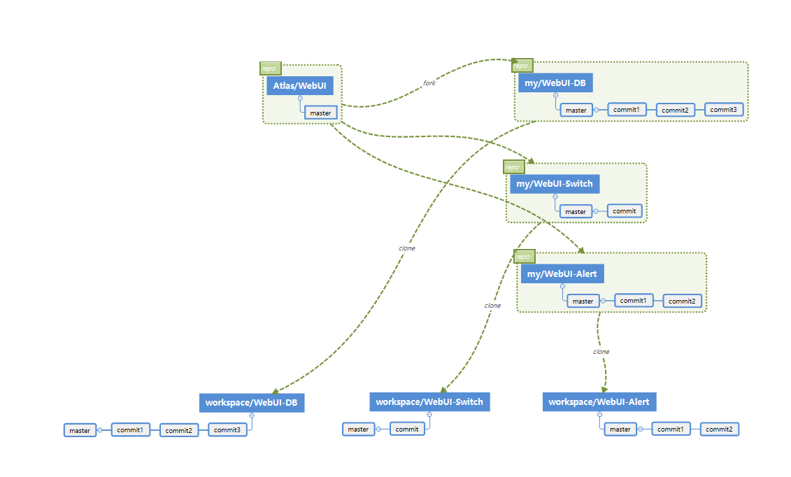


我们会fork三个仓库，然后分别clone，然后在三个目录中修改，分别push进不同的仓库，然后做merge request.

问题显而易见：

* 我们要merge到一个仓库的东西，先用了三个不同的仓库来存放，明显不合理，Linus 不可能这么傻。
* 到我们本地，需要三个目录之间切换。开三个IDE，把三个目录在一个IDE中打开。都不是很合适，开三个要来回切换。开一个，会有很多同名文件。
* 如果在dashboard中写的部分代码，或者我在另一个改动中修改的bug，我也想合并到alert中去。只能手动在文件夹中拷贝，很容易出错。
* 只使用了master分支，没有用到分支这个概念。这是git有别于其他代码版本控制工具的一个非常重要功能。

所以正确的做法应该是：

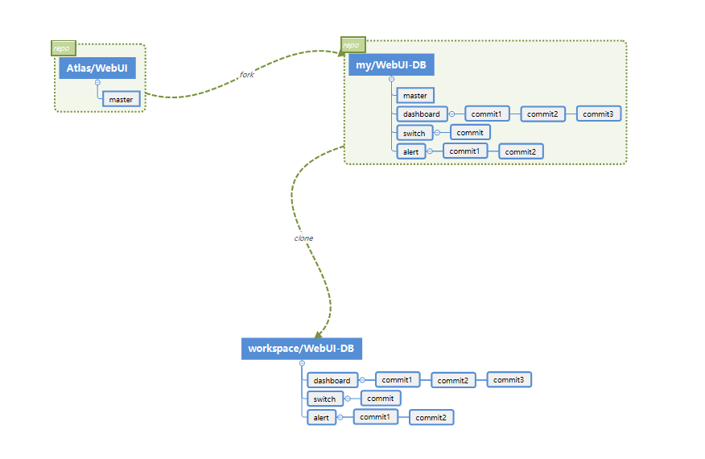

这样子，我们就只要需要fork一个仓库。并且本地只有一个项目。IDE只需要打开一个项目。当我在不同分支之间切换。项目中内容也会自动切换。更重要的一点，可以不同分支的代码可以通过git命令来合并，减少错误。

如果对下面这种方式怎么操作感兴趣可以继续往下看，不感兴趣就可以停下来了，因为在后面介绍的东西对你来说没有意义了。


要再继续，需要了解git一些概念的。

* 本地，在git clone的时候，会把远程仓库整个clone下来。然后我们的操作基本上是对git进行本地操作。

  在我们的项目目录下，有一个隐藏的`.git`（linux下.开头的文件是隐藏文件）文件夹，git仓库的内容就保存在这里面。

* 快照，我们的每次commit，git都是保存项目文件的快照，本地储存在`.git`目录中，而我们在项目目录中看到的是一个快照。

  每个快照有一个hash值。

  每个快照只保存对上一个快照有改变的文件，没有改变的文件直接引用上一个快照的文件


接着看看什么是branch。

比如项目在创建最初时，只有一个最早的文件快照。有一个master分支。其实master分支，就是一个指向这个文件快照的指针。像这样：

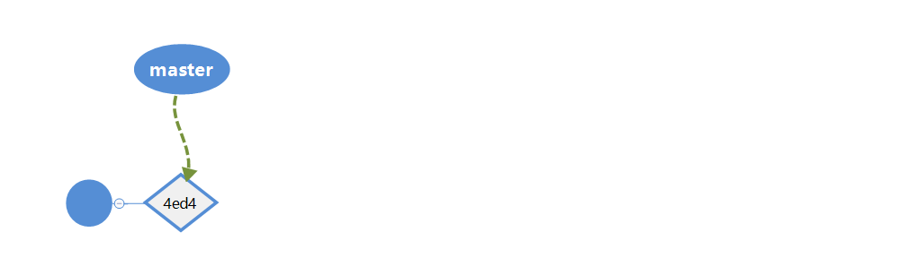

这个时候，我们处在master分支上，我们做了一次commit，这个时候，生成了一个新的文件快照，是基于上一个文件快照的。因为按上面说的，没有改变的文件就是引用上一次文件快照。

这个时候变成：

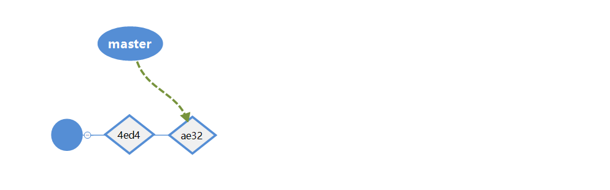

多了一个文件快照，并且master指向了最新的快照。当前项目目录里也是显示的这个文件快照。

这个时候，我准备开发alert的功能了。我创建了一个alert的分支，并切换到了alert分支。

```bash

# -b 带名字，表示在当前基础上创建新的分支，并切换到新的分支上
git checkout -b alert

```

就是创建了一个新的指向最新的文件alert。

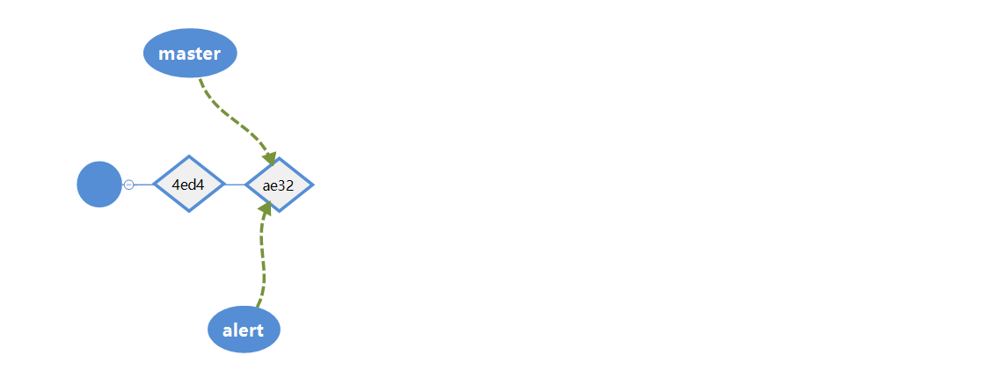


然后我commit了关于alert的代码，生成新的文件快照。


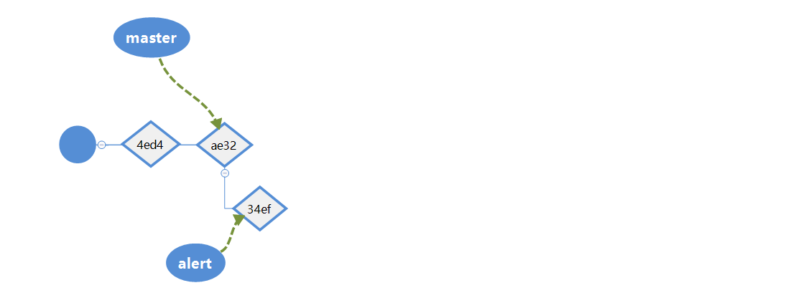

紧接着，新的开发任务来了，我要优先开发switch profile的功能。所以我又切换回master分支。当前项目目录的文件快照切换到了`ae32`，又回到了master的文件结构。

我创建新的switch分支，并切换过去。

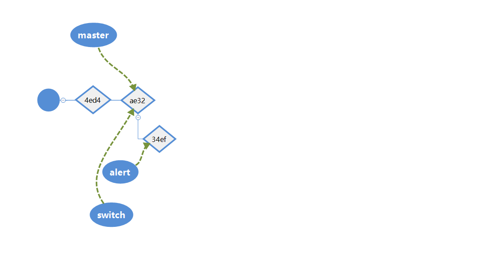


之后做了3个commit.


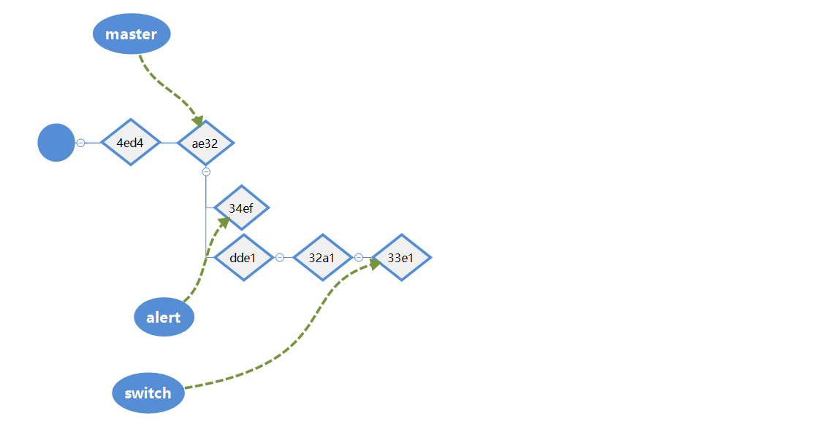


这样，当我切换不同分支的时候，项目目录显示的是不同的文件快照。也就是不同的开发内容。


然后三个功能开发都有一定进展，git是这样的。我们的所有的操作还在本地。需要同步到`my/WebUI`

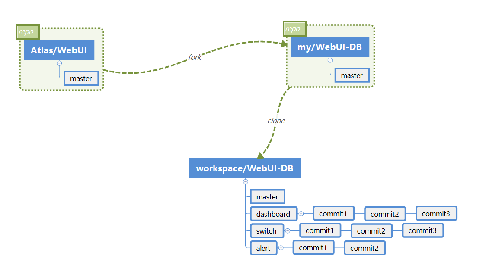


当clone项目下来。本地的git项目会保存仓库的所有内容。并且有对远程仓库的引用。执行下面的命令，可以看到两记录。对应origin仓库（也就是clone的仓库）的fetch和push。

```bash

git remote -v

```

本地git其实是这样的。

可以通过`origin/master`来访问clone下来的仓库的master分支，`origin/1.3.0`来访问clone下来的仓库的1.3.0分支（如果有的话）。由于一直做的是离线操作，所以这个时候origin的内容是执行clone命令的时候的内容。

如果这期间有人往origin这个仓库提交了新的代码，我们需要手动去同步一下最新的代码。

```bash

git fetch origin

```

这个命令将会把最新的代码取下来.


然后如果我想把本地的代码同步到远程仓库去。比如我想把alert分支推送到上去，执行

```bash

git push origin alert:alert

```

这个时候就是：

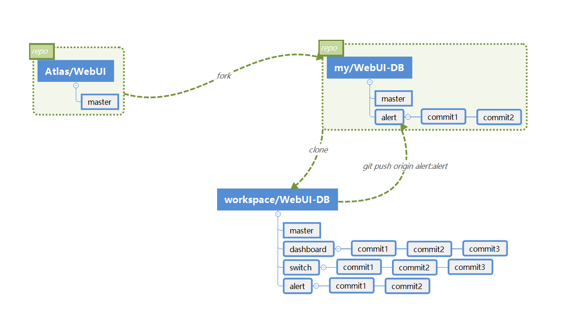


接着就可以做merge request，把alert的分支合到`atlas/WebUI`的master上。


 <待续...>


## 上面提到的命令

```bash

# 克隆项目
git clone xxxx.git

# 基于start-point来创建新的分支，并切换过去，如果start-point省略，就是基于当前的快照来创建
git checkout -b <new-branch> [<start-point>]

# 假设当前在master分支上，就是基于master分支创建alert分支，并切换过去。
git checout -b alert

# 基于origin/master来创建
git checkout -b alert origin/master

# 创建新的分支，但是不切换到新的分支
git branch <new-branch> [<start-point>]

# 切换到branch-name分支
git checkout <branch-name>

```

#### 支持当前流程所需要懂的git命令

```bash

# 找到项目所在仓库，并fork一个仓库到自己账号下面，如果已完成，省略
# 假设项目仓库为： git://host/xxx.git
# fork的仓库为： git://host/my/xxx.git

# clone 自己fork的项目到自己想用的目录，最好别有中文路径
git clone git://host/my/xxx.git

cd xxx

# 本地项目可以指定多个远程仓库，因为自己fork的项目代码一定时间之后就会落后.
# 所以应该给自己的本地项目再添加一个远程仓库，这个远程仓库就是项目仓库
git remote add upstream git://host/xxx.git

# 查看一下是否添加成功，需要多两条upstream的记录
git remote -v

# 前面的操作都是一次性的，之后再不需要做这些操作了。

# 将项目仓库的内容同步到本地
git fetch upstream

# 开始开发dashboard，从项目仓库的master作为我的分支的开始。
git checkout -b dashboard upstream/master


# 已经切换到dashboard分支。可以查看一下
# 如果看命令行内容
git log
# 我更喜欢的图形界面
gitk

# 开始开发，尽量开发一点提交一点，没关系，这个时候的提交都在本地仓库。还没有同步到远程仓库之中。
# git三种状态，待补充到上文

# 讲当前目录的所有文件都变成staged状态
git add .

# 提交一个新的commit
git commit -m <commit-message>

# 将当前staged的文件合入到上一个提交。如果上一个提交已经同步到远程仓库，不要做这样的操作
git commit --amend

git checkout master

git checkout dashboard

# 比如现在要开发新功能，那应该从orign/master来创建新的分支
git checkout -b alert origin/master


# n天过去了，我在本地做了多个提交，同时项目仓库的代码已经加入多个提交。如果我们就这样做合并，会有冲突。所以先把代码合并一下。

# 前面的操作都是在本地进行的。需要先同步一下项目代码
git fetch upstream

# 这个时候如果upstream/master上就是项目最新的代码了。需要合入到dashboard的文职

# 切换到dashboard分支
git checkout dashboard
# 这个时候有两种命令，凭喜好选择，待续补充两者的区别。
git rebase origin/master
# 或者
git merge origin/master

# 如果此时合并有冲突，会发现当前branch变成一个很奇怪的名字了。

# 这个时候可以手动解决冲突，或者使用工具来解决。

# 手动解决的话，可以git diff查看冲突，修改后git add修改的文件。
# 推荐还是使用工具。默认已经配置了一个工具，这个可以自己在git config修改。
git mergetool

# 解决冲突后。执行对应的命令继续
git rebase --continue
# 或者
git merge --continue

# 如果发现自己合乱了，想放弃，执行
git rebase --abort
# 或者
git merge --abort

# 本地合完最新的代码，需要同步到fork的仓库再做merge request

# 由于CI的原因，想要编译成功需要提交master分支。

# 如果不需要生成编译包，只是为了做MR，可以push一个相同名字的远程分支。
git push origin dashboard:dashboard

# 如果需要编译包，这条命令的危险性就是会覆盖master。原来master的代码会被覆盖了。
git push -f origin dashboar:master

```

#### 进一步加深了解的命令

```bash

# 在不同分支切换时，如果有修改的内容不想提交，切换的时候有可能冲突，这个时候可以讲改动存入暂存区
git stash

# 从暂存区取回改动
git stash pop

# 待续...

```
