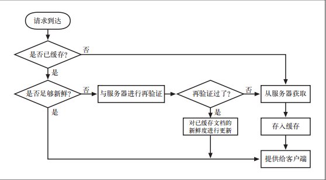

# 缓存

在缓存文档过期之前， 缓存可以以任意频率使用这些副本， 而无需与服务器联系.一
旦已缓存文档过期， 缓存就必须与服务器进行核对， 询问文档是否被修改过， 如果
被修改过， 就要获取一份新鲜（ 带有新的过期日期） 的副本.如果再验证显示内容没有发生变化，
缓存只需要获取新的首部， 包括一个新的过期日期， 并对缓存中的首部进行更新就行了。

正确的缓存返回下列内容之一：
* “ 足够新鲜” 的已缓存副本
* 与服务器进行过再验证， 确认其仍然新鲜的已缓存副本
* 如果需要与之进行再验证的原始服务器出故障了， 就返回一条错误报文
* 附有警告信息说明内容可能不正确的已缓存副本

### 缓存

- `Expires: Fri, 05 Jul 2002, 05:00:00 GMT`(HTTP/1.1)
- `Cache-Control: max-age=484200`(HTTP/1.0+)
- 由于 `Cache-Control` 首部使用的是相对时间而不是绝对日期， 更倾向于使用比较新的 `Cache-Control` 首部。绝对日期依赖于计算机时钟的正确设置.
- 没有上面的的情况下

### 判断

- `If-None-match`
- `If-Modified-Since`

- `If-Match`
- `If-Unmodified-Since`
- `If-Range`

###

- `Cache-Control: max-age=484200`: 值定义了文档的最大使用期——从第一次生成文档到文档不再新鲜、 无法使用为止， 最大的合法生存时间
- `Expires`: 指定一个绝对的过期日期。 如果过期日期已经过了， 就说明文档不再新鲜了

- `IfModified-Since:<date>`: 如果从指定日期之后文档被修改过了， 就执行请求的方法。 可以与
`Last-Modified` 服务器响应首部配合使用， 只有在内容被修改后与已缓存版本有所不同的时候才去获取内容
- `If-None-Match:<tag>`: 服务器可以为文档提供特殊的标签（ 参见 `ETag`）， 而不是将其与最近修
改日期相匹配， 这些标签就像序列号一样。 如果已缓存标签与服务器文档中的标签有所不同， `If-None-Match` 首部就会执行所请求的方法
如果服务器上的实体标签已经发生了变化（ 可能变成了 v3.0）， 服务器会在一个`200 OK`响应中返回新的内容以及相应的新 `Etag`。
